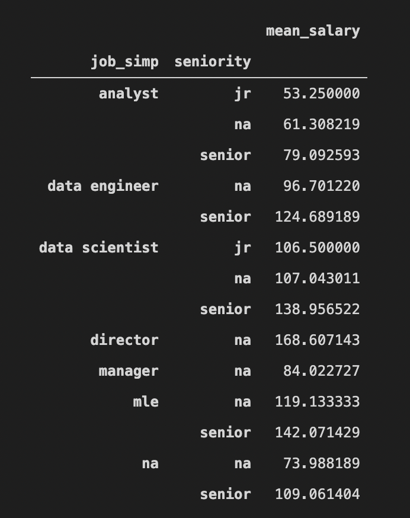
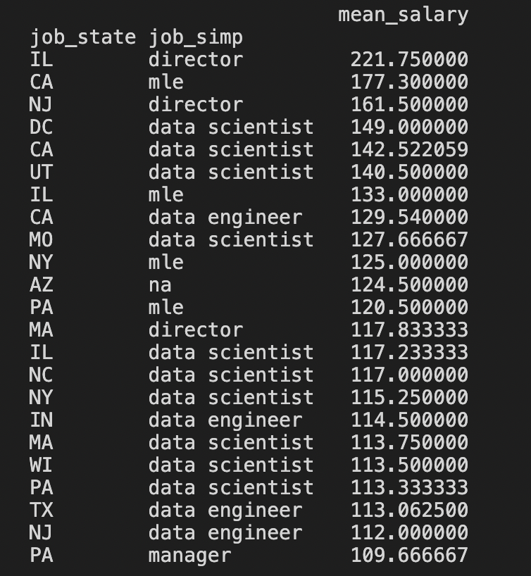
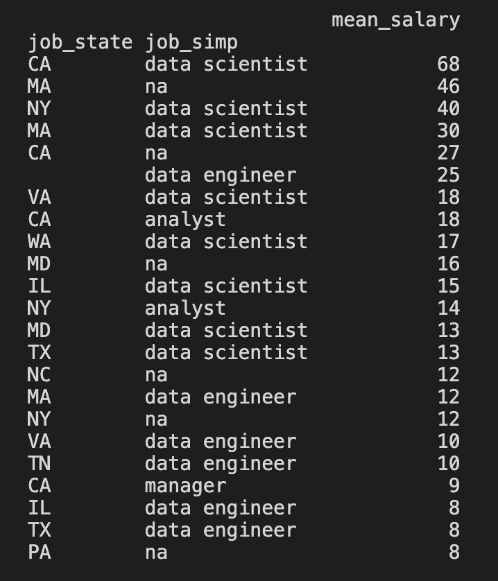
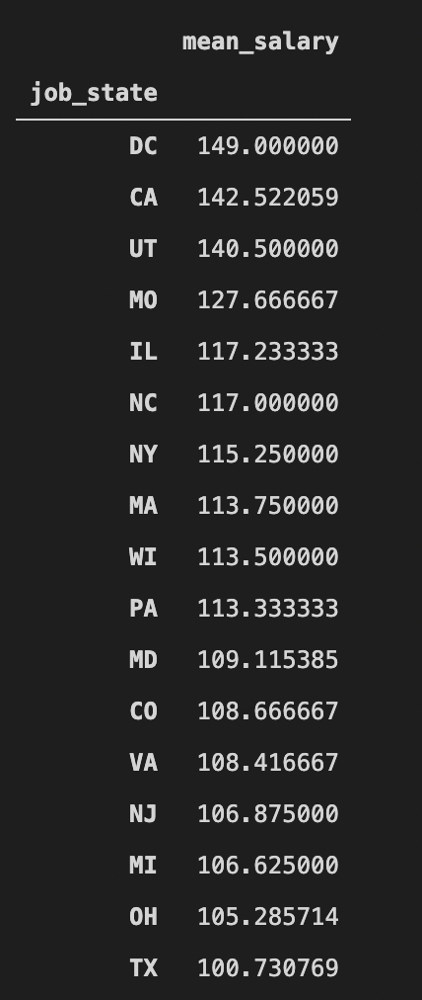

# Data Science Jobs Salary Estimator
`pandas`, `numpy`, `sklearn`, `matplotlib`, `seaborn`, `selenium`, `flask`, `json`, `pickle`

This project focuses on salary analysis for various data science jobs in US.

## End-to-End Project Steps
- Data Collection
- Data Cleaning
- Exploratory Data Analysis (EDA)
- Model Building
- Production

## Project Overview
- Created a tool that estimates data science salaries (MAE ~ $ 11K) to help data scientists negotiate their income when they get a job.
- Engineered features from the text of each job description to quantify the value companies put on python, excel, aws, and spark.
- Optimized `Linear`, `Lasso`, and `Random Forest Regressors` using `RandomizedSearchCV` to reach the best model.
- Built a client facing API using Flask.

## Data
The data was collected from glassdoor.com. It consists of 1000 different job postings.

- Job title
- Salary Estimate
- Job Description
- Rating
- Company
- Location
- Company Headquarters
- Company Size
- Company Founded Date
- Type of Ownership
- Industry
- Sector
- Revenue
- Competitors

## Data Cleaning
- Parsed numeric data out of salary
- Made columns for employer provided salary and hourly wages
- Removed rows without salary
- Parsed rating out of company text
- Made a new column for company state
- Added a column for if the job was at the company’s headquarters
- Transformed founded date into age of company
- Made columns for if different skills were listed in the job description:
    - Python
    - R
    - Excel
    - AWS 
    - Spark
- Column for simplified job title and seniority
- Column for description length

## EDA
The average salary for different roles among all states:   

The average salary for different roles filtered with seniority level among all states:   

Highest salaries in DS roles, as we can see the highest salaries are in California state:   

Job counts in different states:   

How much can you earn annually as a data scientist in different states:   

## Model Building
First, I transformed the categorical variables into dummy variables. I also split the data into train and tests sets with a test size of 20%.

I tried three different models and evaluated them using Mean Absolute Error. I chose MAE because it is relatively easy to interpret and outliers aren’t particularly bad in for this type of model.

I tried three different models:

- **Multiple Linear Regression** – Baseline for the model
- **Lasso Regression** – Because of the sparse data from the many categorical variables, I thought a normalized regression like lasso would be effective.
- **Random Forest** – Again, with the sparsity associated with the data, I thought that this would be a good fit.

## Model performance

The Random Forest model far outperformed the other approaches on the test and validation sets.

- Random Forest: MAE = 11.22
- Linear Regression: MAE = 18.86
- Ridge Regression: MAE = 19.67

## Reference
- **Scraper Github**: https://github.com/arapfaik/scraping-glassdoor-selenium
- **Scraper Article**: https://towardsdatascience.com/selenium-tutorial-scraping-glassdoor-com-in-10-minutes-3d0915c6d905
- **Flask Productionization**: https://towardsdatascience.com/productionize-a-machine-learning-model-with-flask-and-heroku-8201260503d2
